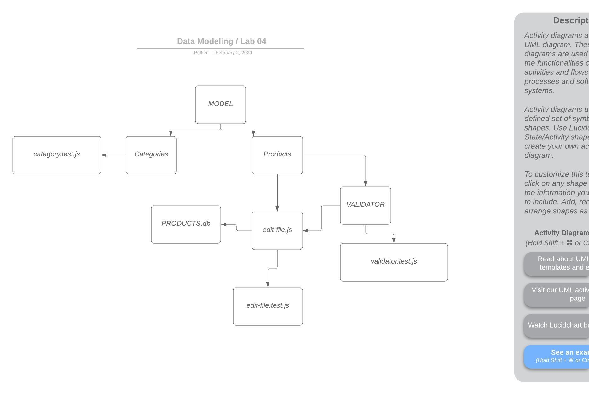

# Apprenti-401-Lab-04

## Project Name

### Author: Lindsay Peltier

### Links and Resources
* [submission PR](https://github.com/LindsayPeltier-401-advanced-javascript/Apprenti-401-Lab-04/pull/1)
* [travis](https://www.travis-ci.com/LindsayPeltier-401-advanced-javascript/Apprenti-401-Lab-04/builds/147110951)

#### Documentation
* `jsdocs` available at `/docs`

### Setup

#### How to initialize/run your server app (where applicable)
* `npm start`
* Endpoint: /docs
  * Returns JSdocs
  
#### Tests
* Unit Tests: `npm test`
* Lint Tests: `npm run lint`

#### UML

#### CODE
* [Link to Code](./fs/edit-file.js)
